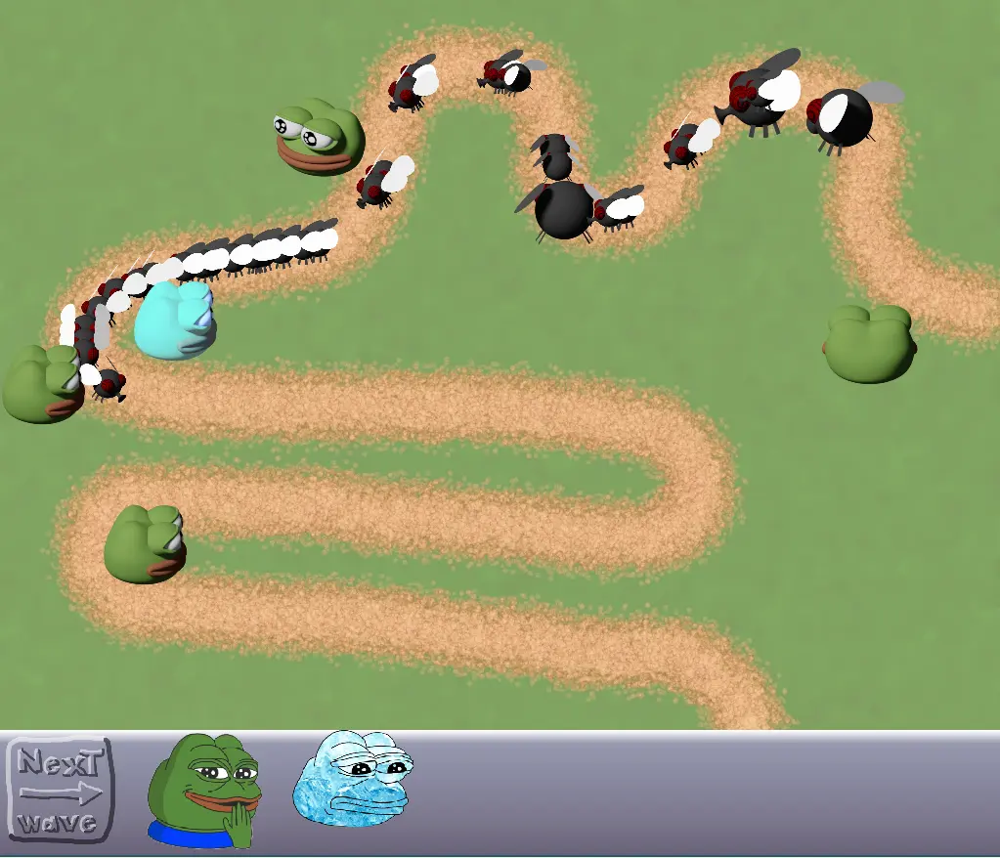

# 🐸 Hangry Frogs

The frogs are hangry, but luckily there are plenty of flies to eat!



# 🛠️ Build Instructions

Install dependencies for SFML. For specifically Ubuntu or Debian distributions
of Linux you can use the following commands.

```bash
sudo apt update
sudo apt install \
    libxrandr-dev \
    libxcursor-dev \
    libxi-dev \
    libudev-dev \
    libfreetype-dev \
    libflac-dev \
    libvorbis-dev \
    libgl1-mesa-dev \
    libegl1-mesa-dev \
    libfreetype-dev
```

Create build files with:

```bash
cmake -B build
```

And build the project with:

```bash
cmake --build build
```

Now you can run with:

```bash
./build/game
```
